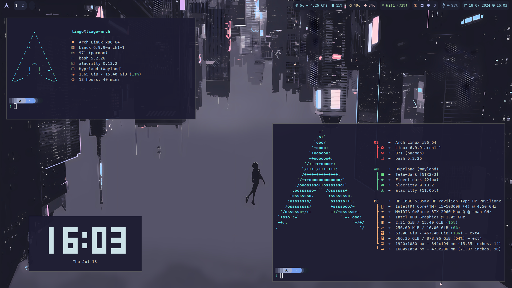

# Dotfiles

My dotfiles for my Arch Linux setup.

## My setup

- **OS**: Arch Linux
- **WM**: Hyprland
- **Terminal**: Kitty
- **Shell**: Zsh w/Oh-My-Zsh
- **File Manager**: Thunar
- **Browser**: Brave
- **Font**: Noto Sans Mono

